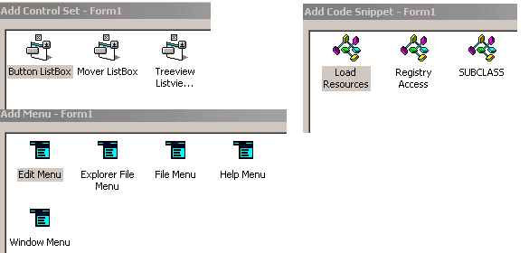

<div align="center">

## a Vb Tip


</div>

### Description

Have you ever wanted to insert automatically Predefind Menus in your Application with out typing all garbage with Menu Editor plus Code Snippets and predefiend Control Sets used in your Previous Applications Plus All useFull Source Code in Psc (Stored in your
 
### More Info
 


<span>             |<span>
---                |---
**Submitted On**   |
**By**             |[Adlawa](https://github.com/Planet-Source-Code/PSCIndex/blob/master/ByAuthor/adlawa.md)
**Level**          |Beginner
**User Rating**    |4.4 (87 globes from 20 users)
**Compatibility**  |VB 5\.0, VB 6\.0
**Category**       |[Custom Controls/ Forms/  Menus](https://github.com/Planet-Source-Code/PSCIndex/blob/master/ByCategory/custom-controls-forms-menus__1-4.md)
**World**          |[Visual Basic](https://github.com/Planet-Source-Code/PSCIndex/blob/master/ByWorld/visual-basic.md)
**Archive File**   |[](https://github.com/Planet-Source-Code/adlawa-a-vb-tip__1-41483/archive/master.zip)


### Source Code

```
<html xmlns:o="urn:schemas-microsoft-com:office:office"
xmlns:w="urn:schemas-microsoft-com:office:word"
xmlns="http://www.w3.org/TR/REC-html40">
<head>
<meta http-equiv=Content-Type content="text/html; charset=windows-1252">
<meta name=ProgId content=Word.Document>
<meta name=Generator content="Microsoft Word 9">
<meta name=Originator content="Microsoft Word 9">
<link rel=File-List href="./diff_files/filelist.xml">
<title>H </title>
<!--[if gte mso 9]><xml>
 <o:DocumentProperties>
 <o:Author>adlawa</o:Author>
 <o:LastAuthor>adlawa</o:LastAuthor>
 <o:Revision>2</o:Revision>
 <o:TotalTime>33</o:TotalTime>
 <o:Created>2002-12-14T09:42:00Z</o:Created>
 <o:LastSaved>2002-12-14T09:42:00Z</o:LastSaved>
 <o:Pages>1</o:Pages>
 <o:Company>Interactive Solutions</o:Company>
 <o:Lines>1</o:Lines>
 <o:Paragraphs>1</o:Paragraphs>
 <o:Version>9.2720</o:Version>
 </o:DocumentProperties>
</xml><![endif]-->
<style>
<!--
 /* Style Definitions */
p.MsoNormal, li.MsoNormal, div.MsoNormal
	{mso-style-parent:"";
	margin:0in;
	margin-bottom:.0001pt;
	mso-pagination:widow-orphan;
	font-size:12.0pt;
	font-family:"Times New Roman";
	mso-fareast-font-family:"Times New Roman";}
@page Section1
	{size:8.5in 11.0in;
	margin:1.0in 1.25in 1.0in 1.25in;
	mso-header-margin:.5in;
	mso-footer-margin:.5in;
	mso-paper-source:0;}
div.Section1
	{page:Section1;}
-->
</style>
</head>
<body lang=EN-US style='tab-interval:.5in'>
<div class=Section1>
<p class=MsoNormal>A Tip By Adlawa<o:p></o:p></p>
<p class=MsoNormal><![if !supportEmptyParas]>&nbsp;<![endif]><o:p></o:p></p>
<p class=MsoNormal>This tip is basically for beginners so if your are already
aware of that my apologies for your time anyway Here is what I write<o:p></o:p></p>
<p class=MsoNormal><![if !supportEmptyParas]>&nbsp;<![endif]><o:p></o:p></p>
<p class=MsoNormal>Have you ever wanted to insert automatically Predefined
Menus in your Application with out typing all garbage with Menu Editor plus
Code Snippets and predefined Control Sets used in your Previous Applications
Plus All useful Source Code in Psc (Stored in your Hard Drive) with just on Mouse
Click in VB IDE<o:p></o:p></p>
<p class=MsoNormal>Vb6 let u do it very Easily <o:p></o:p></p>
<p class=MsoNormal><![if !supportEmptyParas]>&nbsp;<![endif]><o:p></o:p></p>
<p class=MsoNormal>Follow the Steps Below<o:p></o:p></p>
<p class=MsoNormal><![if !supportEmptyParas]>&nbsp;<![endif]><o:p></o:p></p>
<p class=MsoNormal>1) Open Visual Basic <o:p></o:p></p>
<p class=MsoNormal><![if !supportEmptyParas]>&nbsp;<![endif]><o:p></o:p></p>
<p class=MsoNormal>2) Click Addins Menu Choose Addin Manager From Menu<o:p></o:p></p>
<p class=MsoNormal><![if !supportEmptyParas]>&nbsp;<![endif]><o:p></o:p></p>
<p class=MsoNormal>3) In List Look For &quot;VB 6 Template Manager&quot; Double
Click it ,Click ok<o:p></o:p></p>
<p class=MsoNormal><![if !supportEmptyParas]>&nbsp;<![endif]><o:p></o:p></p>
<p class=MsoNormal>4) Now Don’t Go in Addins Menu Click Tools and Now You Have
Three more items in Tool Menu<o:p></o:p></p>
<p class=MsoNormal><![if !supportEmptyParas]>&nbsp;<![endif]><o:p></o:p></p>
<p class=MsoNormal><span style="mso-spacerun: yes">  </span>1) Add Code Snippet
(Allow you to Add Quickly Code Snippet To Project Load Resource + ur own)<o:p></o:p></p>
<p class=MsoNormal><span style="mso-spacerun: yes">  </span>2) Add Menu<span
style="mso-spacerun: yes">         </span>(Allow you to Add Predefined Menus
File, Edit, Help Plus Your Own..)<o:p></o:p></p>
<p class=MsoNormal><span style="mso-spacerun: yes">  </span>3) Add Control
Set<span style="mso-spacerun: yes">  </span>(Allow you to Add Predefined
Controls with Code + ur own just give it try)<o:p></o:p></p>
<p class=MsoNormal><![if !supportEmptyParas]>&nbsp;<![endif]><o:p></o:p></p>
<p class=MsoNormal><![if !supportEmptyParas]>&nbsp;<![endif]><o:p></o:p></p>
<p class=MsoNormal><span style="mso-spacerun: yes">  </span>See Figures<o:p></o:p></p>
<p class=MsoNormal><![if !supportEmptyParas]>&nbsp;<![endif]><o:p></o:p></p>
<p class=MsoNormal><span style="mso-spacerun: yes">  </span>Here are the
Directories Where these Snippet Stored in your Hard Drive<o:p></o:p></p>
<p class=MsoNormal><![if !supportEmptyParas]>&nbsp;<![endif]><o:p></o:p></p>
<p class=MsoNormal><span style="mso-spacerun: yes"> </span>&quot;Add Code
Snipped: &quot; VB Directory where Vb installed + Template + Code in My Drive
it Look Like <o:p></o:p></p>
<p class=MsoNormal><span style="mso-spacerun: yes">                   
</span>C:\Program Files\Microsoft Visual Studio\VB98\Template\Code. Store All
your<o:p></o:p></p>
<p class=MsoNormal><span style="mso-spacerun: yes">                   
</span>Planet Source Codes in form of Module here For Quick Access.<o:p></o:p></p>
<p class=MsoNormal><![if !supportEmptyParas]>&nbsp;<![endif]><o:p></o:p></p>
<p class=MsoNormal><![if !supportEmptyParas]>&nbsp;<![endif]><o:p></o:p></p>
<p class=MsoNormal><![if !supportEmptyParas]>&nbsp;<![endif]><o:p></o:p></p>
<p class=MsoNormal><span style="mso-spacerun: yes"> </span>&quot;Add Menu:
&quot; VB Directory where Vb installed + Template + Menu in My Drive it Look
Like <o:p></o:p></p>
<p class=MsoNormal><span style="mso-spacerun: yes">                   
</span>C:\Program Files\Microsoft Visual Studio\VB98\Template\Menu. Store All
your<o:p></o:p></p>
<p class=MsoNormal><span style="mso-spacerun: yes">                   
</span>Menus here For Quick Access.<o:p></o:p></p>
<p class=MsoNormal><![if !supportEmptyParas]>&nbsp;<![endif]><o:p></o:p></p>
<p class=MsoNormal><![if !supportEmptyParas]>&nbsp;<![endif]><o:p></o:p></p>
<p class=MsoNormal><span style="mso-spacerun: yes"> </span>&quot;Add Control
Set: &quot;VB Directory where Vb installed + Template + Controls in My Drive it
Look Like C:\Program Files\Microsoft Visual Studio\VB98\Template\Controls. Store.<span
style="mso-spacerun: yes">  </span>All your (PSC) Controls with Code here for
Quick Access this is Really Cool because it saves a lot....<o:p></o:p></p>
<p class=MsoNormal><![if !supportEmptyParas]>&nbsp;<![endif]><o:p></o:p></p>
<p class=MsoNormal><![if !supportEmptyParas]>&nbsp;<![endif]><o:p></o:p></p>
<p class=MsoNormal><![if !supportEmptyParas]>&nbsp;<![endif]><o:p></o:p></p>
<p class=MsoNormal><span style="mso-spacerun: yes"> </span>Final Words<o:p></o:p></p>
<p class=MsoNormal><span style="mso-spacerun: yes"> </span>In the End if you
think that this VB tip Deserve Vote Please Don’t Hesitate to Vote it. if
this<span style="mso-spacerun: yes">  </span>tip is<span style="mso-spacerun:
yes">  </span>waste of ur time my apologies again <o:p></o:p></p>
<p class=MsoNormal><span style="mso-spacerun: yes"> </span>Thanks for Attention<o:p></o:p></p>
<p class=MsoNormal><![if !supportEmptyParas]>&nbsp;<![endif]><o:p></o:p></p>
</div>
</body>
</html>
```

